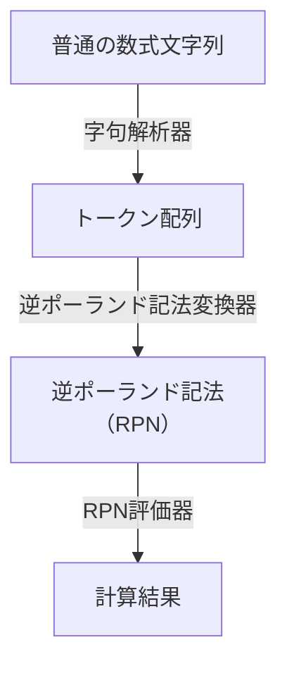

# 数式文字列を計算するExcel関数を作りました

`1+2*(3+4)`のような文字列を解釈して計算結果を返す関数を定義する数式を作りました。以下の数式をExcelの「名前の管理」で登録すると使えるようになります。

:::details 数式（長いので折り畳み）
```
=LET(
    is_num,LAMBDA(v,OR(v=".",ISNUMBER(1*v))),
    is_func_name_char,LAMBDA(v,ISEVEN(IFERROR(XMATCH(CODE(v),{64,90,96,122},1),1))),
    is_func_char,LAMBDA(v,ISEVEN(IFERROR(XMATCH(UNICODE(v),{47,57,64,90,94,95,96,122},1),1))),
    match_char_list,LAMBDA(v,list,NOT(ISNA(XMATCH(v,list)))),

    tokenize_pre,LAMBDA(str,REDUCE("",SEQUENCE(LEN(str)),LAMBDA(p,i,LET(
        c,MID(str,i,1),
        prev,TAKE(p,,-1),
        remain,DROP(p,,-1),
        IFS(
            match_char_list(c,{"+","＋"}),HSTACK(p,"+"),
            match_char_list(c,{"-"}),IF(OR(is_num(prev),prev=")"),HSTACK(p,"-"),HSTACK(p,"nega"," ")),
            match_char_list(c,{"*","×"}),HSTACK(p,"*"),
            match_char_list(c,{"/","÷","／"}),HSTACK(p,"/"),
            match_char_list(c,{"^"}),HSTACK(p,"^"),
            match_char_list(c,{"√"}),HSTACK(p,"sqrt"," "),
            match_char_list(c,{"π"}),HSTACK(p,"pi"),
            AND(is_func_char(c),is_func_name_char(prev)),HSTACK(remain,prev&c),
            AND(is_num(c),is_num(prev)),HSTACK(remain,prev&c),
            TRUE,HSTACK(p,c)
        )
    )))),
    remove_spaces,LAMBDA(str,SUBSTITUTE(str," ","")),
    tokenize,LAMBDA(arr,DROP(MAP(tokenize_pre(remove_spaces(arr)),LAMBDA(v,IF(is_num(v),1*v,v))),,1)),

    operators,{"+";"-";"*";"/";"^";"√";"nega";"min";"max";"pi";"(";")";",";" "},
    operator_priority_table,{2,"lo";2,"lo";3,"lo";3,"lo";4,"lo";0,"fn";5,"fn";0,"fn";0,"fn";6,"fn";2,"lp";2,"rp";2,"sp";0,"br"},

    get_priority,LAMBDA(t,INDEX(XLOOKUP(t,operators,operator_priority_table,0),1,1)),
    get_direction,LAMBDA(t,IF(ISNUMBER(t),"no",INDEX(XLOOKUP(t,operators,operator_priority_table,{"",""}),1,2))),
    h_reverse,LAMBDA(arr,LET(cols,COLUMNS(arr),MAKEARRAY(ROWS(arr),cols,LAMBDA(r,c,INDEX(arr,r,cols-c+1))))),
    pick_output_stack,LAMBDA(v,LET(w,INDEX(v,1),FILTER(w,NOT(ISNA(w))))),
    pick_operator_stack,LAMBDA(v,LET(w,INDEX(v,2),FILTER(w,NOT(ISNA(w))))),
    reverse_and_join,LAMBDA(a,b,HSTACK(a,h_reverse(b))),

    shunting_yard,LAMBDA(tokens,REDUCE({0;0},tokens,LAMBDA(p,c,LET(
        output,pick_output_stack(p),
        operator,pick_operator_stack(p),

        SWITCH(get_direction(c),
            "no",VSTACK(HSTACK(output,c),operator),
            "fn",VSTACK(output,HSTACK(operator,c)),
            "sp",LET(
                pos,XMATCH("(",operator,,-1),
                o,reverse_and_join(output,DROP(operator,,pos)),
                s,TAKE(operator,,pos),
                VSTACK(o,s)
            ),
            "lo",LET(
                pr_o1,get_priority(c),
                farr,MAP(operator,LAMBDA(v,AND(get_priority(v)>=pr_o1,OR(get_direction(v)="lo",get_direction(v)="ro")))),
                pos,XMATCH(FALSE,farr,,-1),
                o,IF(OR(pos<2,COLUMNS(operator)=pos),output,reverse_and_join(output,DROP(operator,,pos))),
                s,HSTACK(TAKE(operator,,pos),c),
                VSTACK(o,s)
            ),
            "ro",LET(
                pr_o1,get_priority(c),
                farr,MAP(operator,LAMBDA(v,prior(v)>pr_o1)),
                pos,XMATCH(FALSE,farr,,-1),
                o,IF(OR(pos<2,COLUMNS(operator)=pos),output,reverse_and_join(output,DROP(operator,,pos))),
                s,HSTACK(TAKE(operator,,pos),c),
                VSTACK(o,s)
            ),
            "lp",VSTACK(output,HSTACK(operator,c)),
            "rp",LET(
                pos,XMATCH("(",operator,,-1),
                is_func,get_direction(INDEX(operator,pos-1))="fn",
                oo,IF(pos=COLUMNS(operator),output,reverse_and_join(output,DROP(operator,,pos))),
                o,IF(is_func,HSTACK(oo,INDEX(operator,pos-1)),oo),
                s,TAKE(operator,,pos-IF(is_func,2,1)),
                VSTACK(o,s)
            ),
            "br",p
        )
    )))),

    convert_to_rpn,LAMBDA(tokens,LET(
        output_and_stack,shunting_yard(tokens),
        output,pick_output_stack(output_and_stack),
        stack,pick_operator_stack(output_and_stack),
        reverse_and_join(output,stack)
    )),

    eval_rpn,LAMBDA(rpn,REDUCE(,rpn,LAMBDA(stack,c,
        SWITCH(c,
            "+",LET(pop,TAKE(stack,,-2),remain,DROP(stack,,-2),ans,SUM(pop),HSTACK(remain,ans)),
            "-",LET(pop,TAKE(stack,,-2),remain,DROP(stack,,-2),ans,INDEX(pop,1)-INDEX(pop,2),HSTACK(remain,ans)),
            "*",LET(pop,TAKE(stack,,-2),remain,DROP(stack,,-2),ans,PRODUCT(pop),HSTACK(remain,ans)),
            "/",LET(pop,TAKE(stack,,-2),remain,DROP(stack,,-2),ans,INDEX(pop,1)/INDEX(pop,2),HSTACK(remain,ans)),
            "^",LET(pop,TAKE(stack,,-2),remain,DROP(stack,,-2),ans,INDEX(pop,1)^INDEX(pop,2),HSTACK(remain,ans)),
            "sqrt",LET(pop,TAKE(stack,,-1),remain,DROP(stack,,-1),ans,SQRT(pop),HSTACK(remain,ans)),
            "nega",LET(pop,TAKE(stack,,-1),remain,DROP(stack,,-1),ans,-1*pop,HSTACK(remain,ans)),
            "min",LET(pop,TAKE(stack,,-2),remain,DROP(stack,,-2),ans,MIN(pop),HSTACK(remain,ans)),
            "max",LET(pop,TAKE(stack,,-2),remain,DROP(stack,,-2),ans,MAX(pop),HSTACK(remain,ans)),
            "pi",HSTACK(stack,PI()),
            HSTACK(stack,c)
        )
    ))),

    calculate,LAMBDA(str,LET(
        tokens,tokenize(str),
        rpn,convert_to_rpn(tokens),
        result,eval_rpn(rpn),
        SUM(result)
    )),
    calculate
)
```

めっちゃ長いって思いましたよね。私も思いました。
:::

# 概要

この数式はいちど逆ポーランド記法（RPN）に変換することで計算処理を行っています[^1]。

[^1]: 再帰下降構文解析でやろうと思ったらすぐスタックオーバーフローになってしまってダメでした。



# サポートする演算子・記号・関数

数式評価をするときの常ですが、最初に演算子の優先順位と結合方向を定義しておかなければなりません。

今回は四則演算・べき乗・カッコ・のほかにいくつかの関数に対応させます。なお、べき乗はExcelの仕様に合わせて左結合としています。
負値の記号`-`と定数`π`は関数として定義します。

| 演算子               | 優先順位 | 結合方向   | 識別子                 | 補足                                      |
| -------------------- | -------: | ---------- | ---------------------- | ----------------------------------------- |
| +                    | 2        | 左         | lo (left operator)     | `＋`にも対応させる                        |
| -                    | 2        | 左         | lo                     | 負値の記号は別に定義する                  |
| *                    | 3        | 左         | lo                     | `×`、`・`にも対応させる                  |
| /                    | 3        | 左         | lo                     | `÷`、`／`にも対応させる                  |
| ^                    | 4        | 左         | lo                     | 一般的には右結合だがExcelの仕様に合わせる |
| √                   | 0        | 関数       | fn (function)          | `sqrt`                                    |
| -                    | 5        | 関数       | fn                     | （負値の記号） `nega`                     |
| min                  | 0        | 関数       | fn                     | `min` 引数を2つ取る関数とする             |
| max                  | 0        | 関数       | fn                     | `max` 引数を2つ取る関数とする             |
| π                   | 6        | 関数       | fn                     | 定数は引数0の関数扱いとする[^2]           |
| (                    | 2        | 左カッコ   | lp (left parenthesis)  |                                           |
| )                    | 2        | 右カッコ   | rp (right parenthesis) |                                           |
| ,                    | 2        | セパレータ | sp (separator)         | 関数の引数を区切る記号                    |
| [0-9]+(\.([0-9]+)?)? | 0        | 数値       | no (number)            |                                           |

[^2]: 関数扱いで不都合は生じないよね？

# 関数を組み立てる

`LET`関数の中で`tokenize`（字句解析器）、`convert_to_rpn`（逆ポーランド記法変換器）、`eval_rpn`（RPN評価器）を定義し、それらを結合した`calculate`関数を返しています。
この構成で作るとそれぞれのLAMBDA関数ごとのデバッグがしやすいと思います。

```
=LET(
    tokenize,LAMBDA(v,???),
    convert_to_rpn,LAMBDA(v,???),
    eval_rpn,LAMBDA(v,???),
    calculate,LAMBDA(str,let(
        tokens,tokenize(str),
        rpn,convert_to_rpn(tokens),
        result,eval_rpn(rpn),
        SUM(result)
    )),
    calculate
)
```

## 字句解析器

字句解析器はこの部分です。

```
    is_num,LAMBDA(v,OR(v=".",ISNUMBER(1*v))),
    is_func_name_char,LAMBDA(v,ISEVEN(IFERROR(XMATCH(CODE(v),{64,90,96,122},1),1))),
    is_func_char,LAMBDA(v,ISEVEN(IFERROR(XMATCH(UNICODE(v),{47,57,64,90,94,95,96,122},1),1))),
    match_char_list,LAMBDA(v,list,NOT(ISNA(XMATCH(v,list)))),

    tokenize_pre,LAMBDA(str,REDUCE("",SEQUENCE(LEN(str)),LAMBDA(p,i,LET(
        c,MID(str,i,1),
        prev,TAKE(p,,-1),
        remain,DROP(p,,-1),
        IFS(
            match_char_list(c,{"+","＋"}),HSTACK(p,"+"),
            match_char_list(c,{"-"}),IF(OR(is_num(prev),prev=")"),HSTACK(p,"-"),HSTACK(p,"nega"," ")),
            match_char_list(c,{"*","×"}),HSTACK(p,"*"),
            match_char_list(c,{"/","÷","／"}),HSTACK(p,"/"),
            match_char_list(c,{"^"}),HSTACK(p,"^"),
            match_char_list(c,{"√"}),HSTACK(p,"sqrt"," "),
            match_char_list(c,{"π"}),HSTACK(p,"pi"),
            AND(is_func_char(c),is_func_name_char(prev)),HSTACK(remain,prev&c),
            AND(is_num(c),is_num(prev)),HSTACK(remain,prev&c),
            TRUE,HSTACK(p,c)
        )
    )))),
    remove_spaces,LAMBDA(str,SUBSTITUTE(str," ","")),
    tokenize,LAMBDA(arr,DROP(MAP(tokenize_pre(remove_spaces(arr)),LAMBDA(v,IF(is_num(v),1*v,v))),,1)),
```

1. `remove_spaces`関数で、文字列から空白を取り除く
1. `tokenize_pre`関数で、1文字ずつ読んで以下のように配列を組み立てる
   - 読んでいる文字`c`が数値の一部か関数名の一部であり、かつ配列の末尾`prev`と同種なら配列の末尾の文字列に結合する（popしてjoinしてpushする）
   - 読んでいる文字`c`が数値の一部か関数名の一部であり、配列の末尾`prev`と**別種**なら配列の末尾に新しい要素として`c`を連結する（pushする）
   - それ以外なら読んでいる文字`c`に応じた記号を配列に連結する（pushする）
1. `tokenize`関数で、配列の中の数値を表す文字列を数値に変換する

## 逆ポーランド記法（RPN）変換器

最初の2つの配列は演算子の優先順位表を定義したものです。`operators`が演算子のリスト、`operator_priority_table`が優先順位や結合方向を定義したテーブルです。

```
    operators,{"+";"-";"*";"/";"^";"√";"nega";"min";"max";"pi";"(";")";",";" "},
    operator_priority_table,{2,"lo";2,"lo";3,"lo";3,"lo";4,"lo";0,"fn";5,"fn";0,"fn";0,"fn";6,"fn";2,"lp";2,"rp";2,"sp";0,"br"},
```

そして、RPN変換器はこの部分です。

```
    get_priority,LAMBDA(t,INDEX(XLOOKUP(t,operators,operator_priority_table,0),1,1)),
    get_direction,LAMBDA(t,IF(ISNUMBER(t),"no",INDEX(XLOOKUP(t,operators,operator_priority_table,{"",""}),1,2))),
    h_reverse,LAMBDA(arr,LET(cols,COLUMNS(arr),MAKEARRAY(ROWS(arr),cols,LAMBDA(r,c,INDEX(arr,r,cols-c+1))))),
    pick_output_stack,LAMBDA(v,LET(w,INDEX(v,1),FILTER(w,NOT(ISNA(w))))),
    pick_operator_stack,LAMBDA(v,LET(w,INDEX(v,2),FILTER(w,NOT(ISNA(w))))),
    reverse_and_join,LAMBDA(a,b,HSTACK(a,h_reverse(b))),

    shunting_yard,LAMBDA(tokens,REDUCE({0;0},tokens,LAMBDA(p,c,LET(
        output,pick_output_stack(p),
        operator,pick_operator_stack(p),

        SWITCH(get_direction(c),
            "no",VSTACK(HSTACK(output,c),operator),
            "fn",VSTACK(output,HSTACK(operator,c)),
            "sp",LET(
                pos,XMATCH("(",operator,,-1),
                o,reverse_and_join(output,DROP(operator,,pos)),
                s,TAKE(operator,,pos),
                VSTACK(o,s)
            ),
            "lo",LET(
                pr_o1,get_priority(c),
                farr,MAP(operator,LAMBDA(v,AND(get_priority(v)>=pr_o1,OR(get_direction(v)="lo",get_direction(v)="ro")))),
                pos,XMATCH(FALSE,farr,,-1),
                o,IF(OR(pos<2,COLUMNS(operator)=pos),output,reverse_and_join(output,DROP(operator,,pos))),
                s,HSTACK(TAKE(operator,,pos),c),
                VSTACK(o,s)
            ),
            "ro",LET(
                pr_o1,get_priority(c),
                farr,MAP(operator,LAMBDA(v,prior(v)>pr_o1)),
                pos,XMATCH(FALSE,farr,,-1),
                o,IF(OR(pos<2,COLUMNS(operator)=pos),output,reverse_and_join(output,DROP(operator,,pos))),
                s,HSTACK(TAKE(operator,,pos),c),
                VSTACK(o,s)
            ),
            "lp",VSTACK(output,HSTACK(operator,c)),
            "rp",LET(
                pos,XMATCH("(",operator,,-1),
                is_func,get_direction(INDEX(operator,pos-1))="fn",
                oo,IF(pos=COLUMNS(operator),output,reverse_and_join(output,DROP(operator,,pos))),
                o,IF(is_func,HSTACK(oo,INDEX(operator,pos-1)),oo),
                s,TAKE(operator,,pos-IF(is_func,2,1)),
                VSTACK(o,s)
            ),
            "br",p
        )
    )))),

    convert_to_rpn,LAMBDA(tokens,LET(
        output_and_stack,shunting_yard(tokens),
        output,pick_output_stack(output_and_stack),
        stack,pick_operator_stack(output_and_stack),
        reverse_and_join(output,stack)
    )),
```

RPN変換器は操車場アルゴリズムの実装です。操車場アルゴリズムはスタック操作で数式を変換するアルゴリズムで、再帰呼び出しの必要がありません。
再帰に弱いExcelの`LAMBDA`関数でも使えます。

`shunting_yard`関数内の`REDUCE({0;0},`で、2行1列の配列として出力キューと演算子スタックを初期化しています。1行目が出力キュー、2行目が演算子スタックです。
演算子スタックに0を入れておくと演算子の優先順位判定などで番兵として機能してくれます[^3]。

[^3]: 出力キューを0で初期化しているのは`""`とするより文字数が少ないからだった気がします。

`SWITCH`文ではトークンの種類に応じて出力キューと演算子スタックを更新し、全てのトークンを処理した後、`convert_to_rpn`で出力キューと演算子スタックを結合します。これがRPNでの数式になっています。

アルゴリズムの詳細はWikipediaなどをご覧ください。

https://ja.wikipedia.org/wiki/%E6%93%8D%E8%BB%8A%E5%A0%B4%E3%82%A2%E3%83%AB%E3%82%B4%E3%83%AA%E3%82%BA%E3%83%A0

## RPN評価器

いよいよ大詰め、RPN評価器の実装です。

```
    eval_rpn,LAMBDA(rpn,REDUCE(,rpn,LAMBDA(stack,c,
        SWITCH(c,
            "+",LET(pop,TAKE(stack,,-2),remain,DROP(stack,,-2),ans,SUM(pop),HSTACK(remain,ans)),
            "-",LET(pop,TAKE(stack,,-2),remain,DROP(stack,,-2),ans,INDEX(pop,1)-INDEX(pop,2),HSTACK(remain,ans)),
            "*",LET(pop,TAKE(stack,,-2),remain,DROP(stack,,-2),ans,PRODUCT(pop),HSTACK(remain,ans)),
            "/",LET(pop,TAKE(stack,,-2),remain,DROP(stack,,-2),ans,INDEX(pop,1)/INDEX(pop,2),HSTACK(remain,ans)),
            "^",LET(pop,TAKE(stack,,-2),remain,DROP(stack,,-2),ans,INDEX(pop,1)^INDEX(pop,2),HSTACK(remain,ans)),
            "sqrt",LET(pop,TAKE(stack,,-1),remain,DROP(stack,,-1),ans,SQRT(pop),HSTACK(remain,ans)),
            "nega",LET(pop,TAKE(stack,,-1),remain,DROP(stack,,-1),ans,-1*pop,HSTACK(remain,ans)),
            "min",LET(pop,TAKE(stack,,-2),remain,DROP(stack,,-2),ans,MIN(pop),HSTACK(remain,ans)),
            "max",LET(pop,TAKE(stack,,-2),remain,DROP(stack,,-2),ans,MAX(pop),HSTACK(remain,ans)),
            "pi",HSTACK(stack,PI()),
            HSTACK(stack,c)
        )
    ))),
```

RPN評価器は以下の手順でRPNトークン配列を評価し、計算結果を返します。

1. RPNのトークンを前から順番に処理する
   - トークンが数値の場合はスタックに積む（操車場でもやった`REDUCE`関数での操作）
   - トークンが演算子の場合は次の操作を行う
     1. スタックから必要な数の数値をpopする
     1. 取り出した数値に対して演算を実行する
     1. 演算結果をスタックにpushする

## 全部組み合わせて完成

ここまでで作った`tokenize`関数・`convert_to_rpn`関数・`eval_rpn`関数を直列につなげたのが数式文字列を計算する関数です（全文は記事冒頭の折り畳みをご覧ください）。長い式になりましたが、ついに完成です。

# 蛇足

- この数式は1年くらい前にほとんど完成していたんだけど、記事を書くのがめんどくさくて放置してました。なんとか書けて良かった。
- Excelにも正規表現関数がやってきたので、それを使えば字句解析器はもうちょっとスッキリ書けそう。
- 引数の数が自由な関数を実現するためのふわっとしたアイデアもあるので、時間のあるときに実装したい。
- 変数名をブラッシュアップするためにGemini（2.0 Flash Thinking Experimental）にこの数式を丸投げしたら、ほぼ完ぺきに意味を読み取って解説してくれた。**もうこんな記事書かなくてもお前でいいじゃん**。